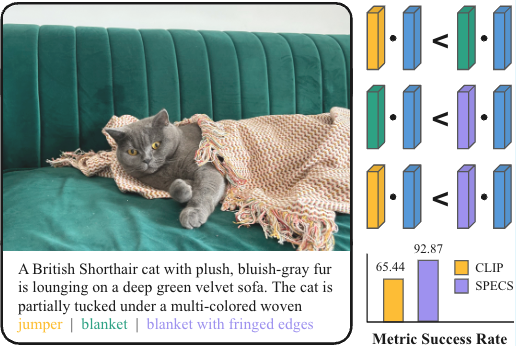

# SPECS
SPECS: Specificity-Enhanced CLIP-Score for Long Image Caption Evaluation

<p align="center"> <a>  

</a> </p>

**SPECS: Specificity-Enhanced CLIP-Score for Long Image Caption Evaluation**\
[Xiaofu Chen](https://xxfchen.github.io/XiaofuChen/), [Israfel Salazar](https://israfelsr.github.io/), [Yova Kementchedjhieva](https://yovakem.github.io/)

## 💡 Highlights
- 🔥 **Specificity Metric** SPECS introduces a novel specificity-focused evaluation metric based on CLIP, enhancing accuracy in assessing detailed visual information in dense image captions.
- 🔥 **Human Alignment** Achieves state-of-the-art correlation with human judgments among Representational Similarity metrics, highly competitive with many LLM-based evaluation methods.
- 🔥 **Efficiency** Provides a faster and more resource-efficient evaluation approach compared to computationally expensive LLM-based metrics.


## 🛠️ Usage


### how to use

Please first clone our [repo](https://github.com/mbzuai-nlp/SPECS.git) from github by running the following command.

```shell
git clone https://github.com/mbzuai-nlp/SPECS.git
cd SPECS
```

### Environment

```shell
conda env create -f environment.yml
pip install git+https://github.com/openai/CLIP.git
python -m spacy download en_core_web_sm
```

Then, download the checkpoints of our model [SPEC](https://huggingface.co/Xiaohud/SPECS) and place it under `./checkpoints`

### Dataset
#### Training Dataset

Prepare ShareGPT4V dataset

First, download all images we used.
- LAION-CC-SBU-558K: [images.zip](https://huggingface.co/datasets/liuhaotian/LLaVA-Pretrain/blob/main/images.zip)
- COCO: [train2017](http://images.cocodataset.org/zips/train2017.zip)
- WebData: [images](https://drive.google.com/drive/folders/1tCUQ-sq6vdshZVkF0ZeF3K4eztkXJgax?usp=sharing). Only for academic usage.
- SAM: [images](https://ai.meta.com/datasets/segment-anything-downloads/). We only use 000000~000050.tar for now. If you just want to use ShareGPT4V for SFT, you can quickly download 9K images from [here](https://drive.google.com/file/d/1dKumdOKSXtV7lIXdrG7jsIK_z2vZv2gs/view?usp=drive_link). 
- GQA: [images](https://downloads.cs.stanford.edu/nlp/data/gqa/images.zip)
- OCR-VQA: [download script](https://drive.google.com/drive/folders/1_GYPY5UkUy7HIcR0zq3ZCFgeZN7BAfm_?usp=sharing). We save all files as `.jpg`
- TextVQA: [trainvalimages](https://dl.fbaipublicfiles.com/textvqa/images/train_val_images.zip)
- VisualGenome: [part1](https://cs.stanford.edu/people/rak248/VG_100K_2/images.zip), [part2](https://cs.stanford.edu/people/rak248/VG_100K_2/images2.zip)

Then, download the long caption of these image [share-captioner_coco_lcs_sam_1246k_1107.json](https://huggingface.co/datasets/Lin-Chen/ShareGPT4V/blob/main/share-captioner_coco_lcs_sam_1246k_1107.json)


organize the data as follows in `projects/ShareGPT4V/data`:

```none
ShareGPT4V
├── ...
├── data
|   ├── share-captioner_coco_lcs_sam_1246k_1107.json
│   ├── llava
│   │   ├── llava_pretrain
│   │   │   ├── images
│   ├── coco
│   │   ├── train2017
│   ├── sam
│   │   ├── images
│   ├── gqa
│   │   ├── images
│   ├── ocr_vqa
│   │   ├── images
│   ├── textvqa
│   │   ├── train_images
│   ├── vg
│   │   ├── VG_100K
│   │   ├── VG_100K_2
│   ├── share_textvqa
│   │   ├── images
│   ├── web-celebrity
│   │   ├── images
│   ├── web-landmark
│   │   ├── images
│   ├── wikiart
│   │   ├── images
├── ...
```


When download the ShareGPT4V dataset then use /SPECS/data/create_sharegpt4v.py to preprocess the dataset.


#### Test Dataset

[sDCI](https://huggingface.co/Xiaohud/SPECS) dataset consisting of 7805 images, each paired with 10 captions.


### Evaluation

You can compute SPECS scores for an image–caption pair using the following code:


```python
from PIL import Image
import torch
import torch.nn.functional as F
from model import longclip

# Device configuration
device = "cuda" if torch.cuda.is_available() else "cpu"
print(f"Using device: {device}")

# Load SPECS model
model, preprocess = longclip.load("spec.pt", device=device)
model.eval()

# Load image
image_path = "SPECS/images/cat.png"
image = preprocess(Image.open(image_path)).unsqueeze(0).to(device)

# Define text descriptions
texts = [
    "A British Shorthair cat with plush, bluish-gray fur is lounging on a deep green velvet sofa. "
    "The cat is partially tucked under a multi-colored woven jumper.",
    "A British Shorthair cat with plush, bluish-gray fur is lounging on a deep green velvet sofa. "
    "The cat is partially tucked under a multi-colored woven blanket.",
    "A British Shorthair cat with plush, bluish-gray fur is lounging on a deep green velvet sofa. "
    "The cat is partially tucked under a multi-colored woven blanket with fringed edges."
]

# Process inputs
text_tokens = longclip.tokenize(texts).to(device)

# Get features and calculate SPECS
with torch.no_grad():
    image_features = model.encode_image(image)
    text_features = model.encode_text(text_tokens)
    
    # Calculate cosine similarity
    similarity = F.cosine_similarity(image_features.unsqueeze(1), text_features.unsqueeze(0), dim=-1)
    
    # SPECS
    specs_scores = torch.clamp((similarity + 1.0) / 2.0, min=0.0)

# Output results
print("SPECS")
for i, score in enumerate(specs_scores.squeeze()):
    print(f" Text {i+1}: {score:.4f}")
```

This shows that SPECS successfully assigns progressively higher scores to captions with more fine-grained and correct details:

- **Text 1**: *"A British Shorthair cat with plush, bluish-gray fur is lounging on a deep green velvet sofa. The cat is partially tucked under a multi-colored woven jumper."*  
  → **Score: 0.4293**

- **Text 2**: *"A British Shorthair cat with plush, bluish-gray fur is lounging on a deep green velvet sofa. The cat is partially tucked under a multi-colored woven blanket."*  
  → **Score: 0.4457**

- **Text 3**: *"A British Shorthair cat with plush, bluish-gray fur is lounging on a deep green velvet sofa. The cat is partially tucked under a multi-colored woven blanket with fringed edges."*  
  → **Score: 0.4583**


#### Zero-shot classification

To run zero-shot classification on imagenet dataset, run the following command after preparing the data
```shell
cd /SPECS/evaluation/extrinsic/classification/imagenet
python imagenet.py
```

Similarly, run the following command for cifar datset
```shell
cd /SPECS/evaluation/extrinsic/classification/cifar
python cifar10.py               #cifar10
python cifar100.py              #cifar100
```

#### Retrieval
To run text-image retrieval on COCO2017 or Urban1k, run the following command after preparing the data
```shell
cd /SPECS/evaluation/extrinsic/retrieval/coco.py
python coco.py                  #COCO2017
python Urban1k.py               #Urban1k
```
#### Intrinsic
Download the dataset from the [HuggingFace](https://huggingface.co/Xiaohud/SPECS/tree/main/test).
```shell
cd /SPECS/evaluation/intrinsic/scripts
python specs \
--model_name_or_path  \
--data_dir  \
--data_split test \
--output_dir /path/to/save/results \
--postfix _longclipeval            
```


### Trian

```shell
bash /SPECS/train/run_spec.sh
```
<!-- 
## Citation
If you find our work helpful for your research, please consider giving a citation:
```

``` -->
